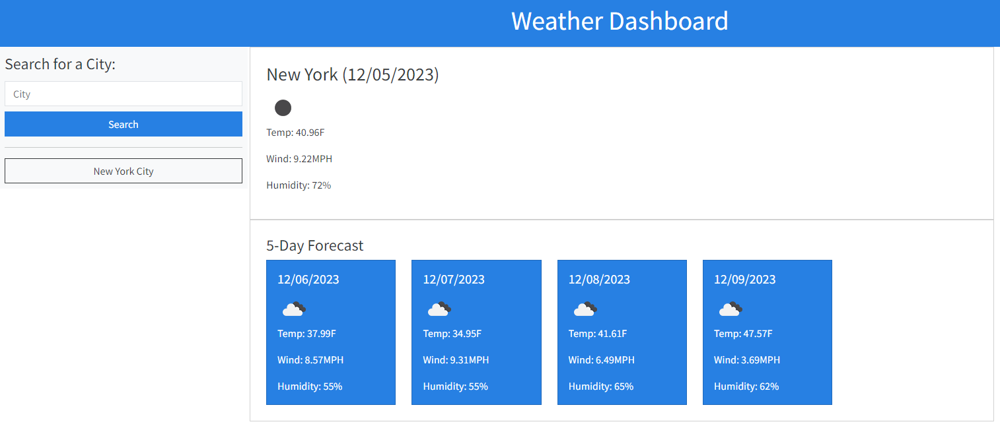

# Weather Dashboard

## Description

This project allows you to check a 5-day weather forecast in an inputted city.  This was made possible thanks to the .

## Installation

N/A

## Usage

This website can be viewed at https://artificialair.github.io/weather-dashboard.  Enter a city name into the search bar to see a 5-day weather forecast.

The following is a screenshot of the finished website.

## License

Please refer to the LICENSE in the repo.